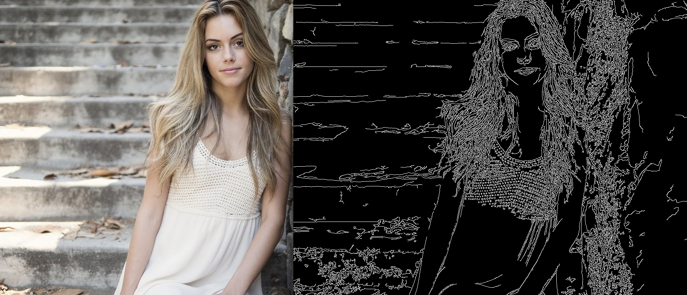

# Detector de Bordas em Imagem


## Objetivo

Um projeto de detecção de bordas, como o que desenvolvemos, tem vários objetivos e aplicações práticas no campo do processamento de imagens e visão computacional. Aqui estão alguns dos principais objetivos e usos:

1. **Análise de Imagens**
   - **Extração de Características**: A detecção de bordas é uma técnica fundamental para extrair características importantes de uma imagem, como contornos e formas. Isso é crucial para a análise de imagens em várias aplicações.

2. **Pré-processamento para Outros Algoritmos**
   - **Preparação para Segmentação**: A detecção de bordas pode ser usada como um passo de pré-processamento para segmentação de imagem, onde a imagem é dividida em regiões significativas.
   - **Facilitar Reconhecimento de Padrões**: A detecção de bordas pode ajudar algoritmos de reconhecimento de padrões a identificar objetos ou formas dentro de uma imagem.

3. **Aplicações em Visão Computacional**
   - **Detecção de Objetos**: Usada em sistemas de visão computacional para identificar e localizar objetos em imagens ou vídeos.
   - **Navegação Robótica**: Em robótica, a detecção de bordas ajuda robôs a entender o ambiente ao seu redor, permitindo que eles naveguem de forma eficaz.

4. **Melhorar Imagens**
   - **Aprimoramento Visual**: Pode ser utilizada para melhorar a visualização de imagens, destacando contornos e estruturas que podem não ser visíveis em uma imagem original.

5. **Educação e Pesquisa**
   - **Aprendizado**: Projetos como esse são frequentemente usados em ambientes educacionais para ensinar conceitos de processamento de imagens e programação.
   - **Experimentos**: Pesquisadores podem usar a detecção de bordas como base para desenvolver novos algoritmos ou testar técnicas de processamento de imagem.

6. **Indústria**
   - **Inspeção de Qualidade**: Na manufatura, a detecção de bordas é utilizada para inspecionar produtos e garantir que atendam aos padrões de qualidade.
   - **Análise de Imagens Médicas**: Em imagens médicas, pode ajudar na identificação de contornos de órgãos ou tumores.

## Estrutura do Projeto

O projeto é dividido em vários arquivos e módulos, cada um com sua função específica:

```
edge_detector/
│
├── data/
|   ├── input/
|   |   └── example.jpg
|   |
|   └── output/
|       └── edges_output.jpg
|
├── edge_detector/
│   ├── __init__.py
│   ├── detector.py
│   └── utils.py
│
├── README.md
├── requirements.txt
└── main.py
```

**1. `requirements.txt`**

Este arquivo lista as dependências necessárias para o projeto. Neste caso, estamos usando:

- `opencv-python`: A biblioteca principal para processamento de imagens.
- `numpy`: Usada para operações de matriz, que são frequentes no processamento de imagens.

**2. `__init__.py`**

Este arquivo indica que o diretório `edge_detector` deve ser tratado como um pacote Python. Ele pode ser deixado vazio ou conter uma breve descrição do pacote.

**3. `detector.py`**

Este módulo contém a lógica principal para a detecção de bordas. Vamos detalhar suas partes:

Classe `EdgeDetector`

- **Construtor (`__init__`)**:
  - Recebe o caminho da imagem e a carrega usando `cv2.imread`.
  
- **Método `detect_edges`**:
  - Converte a imagem colorida para escala de cinza usando `cv2.cvtColor`.
  - Aplica o algoritmo Canny para detectar bordas. O método recebe dois parâmetros (`low_threshold` e `high_threshold`) que definem os limites para a detecção.
  
- **Método `show_images`**:
  - Mostra a imagem original e a imagem com as bordas detectadas em janelas separadas. `cv2.waitKey(0)` permite que as janelas sejam exibidas e continue aberta enquanto nenhuma tecla é acionada. `cv2.destroyAllWindows()` fecha todas as janelas abertas.

**4. `utils.py`**

Este módulo contém funções auxiliares, como `save_image`, que salva a imagem no disco:

- **Função `save_image`**:
  - Recebe uma imagem e um caminho para salvá-la, usando `cv2.imwrite`.

**5. `main.py`**

Este é o ponto de entrada do programa. Aqui, as partes do projeto se juntam:

- **Importações**: Importa as classes e funções necessárias do pacote `edge_detector`.

- **Função `main`**:
  - Define o caminho da imagem que será processada.
  - Cria uma instância da classe `EdgeDetector` com o caminho da imagem.
  - Chama o método `detect_edges` para detectar bordas.
  - Chama `show_images` para mostrar as imagens.
  - Chama `save_image` para salvar a imagem de bordas.

- **Execução do Script**: Verifica se o script está sendo executado diretamente e chama a função `main`.
  
**6. `data`**

Esse diretório contém os dados/imagens manipulados pelo software.
  - **input**: armazena a imagem que será manipulada.
  - **output**: disponibiliza a imagem processada pelo script `main.py`.

## Instruções para Rodar o Projeto

1. **Instalação das Dependências**: Execute o seguinte comando para instalar as dependências do projeto.

   ```bash
   pip install -r requirements.txt
   ```

2. **Substitua o Caminho da Imagem**: No arquivo `main.py`, substitua `'data/input/example.jpg'` pelo caminho da imagem que você deseja processar.

3. **Executar o Projeto**: Execute o script principal.

   ```bash
   python main.py
   ```

   ou

   ```bash
   python3 main.py
   ```

Isso deve abrir duas janelas: uma com a imagem original e outra com a detecção de bordas. A imagem de bordas também será salva como `edges_output.jpg`.

## Fluxo do Programa

1. **Inicialização**: O usuário fornece o caminho da imagem.
2. **Detecção de Bordas**: O programa carrega a imagem, converte para escala de cinza e aplica o algoritmo de Canny.
3. **Exibição**: As imagens original e com bordas são exibidas.
4. **Salvamento**: A imagem com bordas é salva em um arquivo.

## Conclusão

O projeto implementou de maneira simples e modular a detecção de bordas, demonstrando como usar o OpenCV em Python. A estrutura em módulos torna o código mais organizado e fácil de entender, permitindo que você amplie ou modifique cada parte independentemente. Caso seja necessario adicionar novas funcionalidades, como diferentes métodos de detecção de bordas ou pré-processamento de imagens, isso pode ser realizado sem maiores dificuldades.

Para exemplificar a execução do software, exibimos a imagem abaixo:




